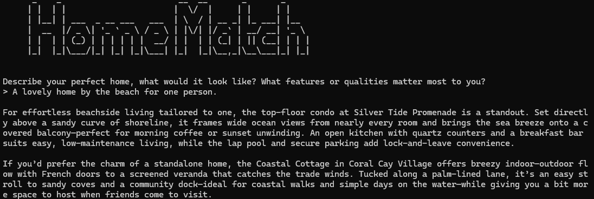
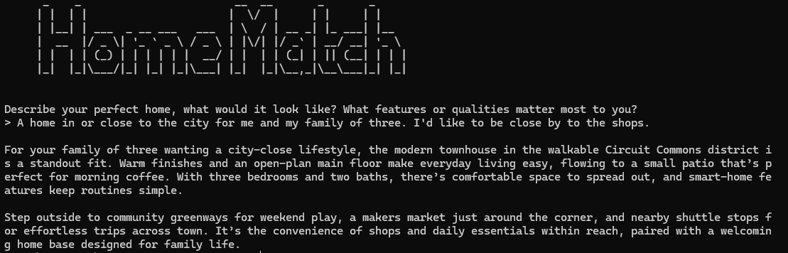

# 🏡 HomeMatch

**RMIT Project: Personalised Real Estate Agent**

An application that leverages LLMs and vector databases to transform standard real estate listings into personalised 
recommendations that are based on the user's text input.

## Prerequisites

- Python 3.13

## How to set up

1. Create virtual environment
   ```shell
   venv\Scripts\python -m pip install -r requirements.txt
   ```

2. Install requirements
   ```shell
   venv\Scripts\python -m pip install -r requirements.txt
   ```
   
3. Replace "YOUR API KEY" with your ChatGPT API Key in [config.yaml](config.yaml)
   ```python
   api-key: YOUR API KEY
   ```
   
## How to run

Run [main.py](main.py)

```shell
venv\Scripts\python main.py
```

When prompted, describe your ideal home. After hitting Enter, you will receive personalised home recommendations
based on your text input.

## Real estate listings

Fake real estate listings are generated with AI and saved to the [real_estate_listings.json](real_estate_listings.json) 
file. If the file already exists when the program is executed, the existing file will be used and a new one will not
be generated.

To generate a new real estate listings file, simply delete the file and run the program.

## View AI prompts

To view the AI prompts being used in the console, set the log level to `DEBUG` in [config.yaml](config.yaml)

```yaml
logging-level: DEBUG
```

## Example responses

These examples highlight how the responses are tailored to the user input and based on the most relevant real estate listings.

### Beach example



### City example



